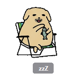
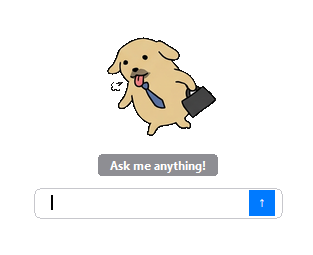
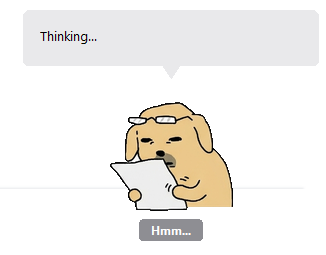
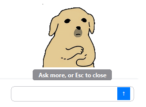

# BuddyGPT

A tiny Shiba that lives in your screen corner and helps you unstuck.

BuddyGPT is not a "do-it-for-me" agent. It is more like a friendly coworker who leans over, takes a quick look at your screen, and gives you a short, practical answer.

## What BuddyGPT Is

BuddyGPT is a desktop companion for lightweight help:
- "What does this email actually want?"
- "Why is this error happening?"
- "Is this page worth reading?"

It stays out of your way, then helps when you ask.

## How It Works

1. **Resting mode**: the Shiba hangs out in the corner.
2. **Wake up**: press `Ctrl+Shift+Space` or click the dog.
3. **Context capture**: BuddyGPT captures your **last active window before wake-up**.
4. **Ask**: type your question and press `Enter`.
5. **Thinking -> Reply**: it analyzes your context and gives a short answer.
6. **Back to rest**:
- Press `Esc` to dismiss immediately.
- If there is no user response after a reply, it auto-returns to `resting` after **15 seconds**.

## Last Active Window Behavior

BuddyGPT tries to answer based on what you were just working on.

Examples:
- If you were writing an email, it captures that email window.
- If you were on a browser tab, it captures that tab window.

Implementation note:
- Wake-up from hotkey and wake-up from mouse click share the same activation pipeline.
- If overlay is foreground during activation, the code attempts to skip overlay and recover your previous real window.

## Pet States

| Resting (`zzZ`) | Awake (`Ask me anything!`) |
|---|---|
|  |  |
| Thinking (`Hmm...`) | Reply (`Ask more, or Esc to close`) |
|  |  |

## Hotkeys and Controls

| Action | Control |
|---|---|
| Wake and capture context | `Ctrl+Shift+Space` |
| Wake and capture context | Click the dog |
| Send question | `Enter` |
| Dismiss current session | `Esc` |
| Quit app | `Ctrl+Shift+Q` |

## Features

- Animated Shiba states: `resting` / `awake` / `thinking` / `reply`
- Active-window screenshot understanding
- App-aware context filtering
- Optional web lookup (DuckDuckGo) when needed
- Short, colleague-style answers
- Language matching (ask in Chinese, get Chinese; ask in English, get English)

## Setup

```bash
pip install -r requirements.txt
py main.py
```

## Configuration

Use `config.json`:

```json
{
  "api_key": "",
  "model": "claude-sonnet-4-20250514",
  "hotkey_activate": "ctrl+shift+space",
  "hotkey_quit": "ctrl+shift+q",
  "screenshot_interval": 3.0,
  "hash_threshold": 12,
  "max_tokens": 1024
}
```

Or use `.env`:

```bash
ANTHROPIC_API_KEY=sk-ant-xxx
```

Config priority in current code:
1. If `config.json` has non-empty `api_key`, that key is used.
2. Otherwise fallback to `.env` `ANTHROPIC_API_KEY`.

## Token Usage (Detailed)

### When tokens are NOT used

No model tokens are consumed for:
- idle animation
- wake-up UI itself
- local window detection
- local screenshot capture/filtering
- drag/move UI actions
- auto-return to resting

### When tokens ARE used

Model tokens are consumed when:
- you send a question (`Enter`)
- you send follow-up questions
- tool-use triggers extra model rounds (for web lookup flow)

### What contributes to token count

Per request, usage is roughly:
- **Input tokens**: system prompt + your question + conversation history + attached context
- **Output tokens**: assistant reply

Important details:
- First turn commonly includes the captured window image.
- Image content can significantly increase input token usage.
- Longer follow-up chains increase history size and input tokens.

### What `max_tokens` actually does

- `max_tokens` limits **output tokens per model call**.
- It does **not** limit input tokens.
- If tool-use causes multiple model calls, each call has its own output cap.

### How to inspect token usage

Runtime logs already print:
- `input_tokens`
- `output_tokens`

You can use this to identify high-cost workflows.

### Practical ways to reduce token cost

- Ask more specific questions in one turn.
- Keep sessions shorter when possible.
- Avoid unnecessary web-search style prompts.
- Wake and ask from cleaner, less noisy screens.

## Privacy and Data Boundaries (Detailed)

### What stays local

These happen locally on your machine:
- hotkey listening
- mouse click wake handling
- active window detection
- screenshot capture and filtering
- UI rendering and pet state machine

Conversation history is held in memory and cleared on each new wake-up session.

### What may be sent externally

When you submit a question, request payload may include:
- your question text
- captured screenshot context
- prompt/context strings

If web lookup is triggered, additional query/result text may be exchanged in the tool-use flow.

### API key handling

- API key can come from `config.json` or `.env`.
- Both `.env` and `config.json` are gitignored in this project.
- Best practice: keep a single source of truth (usually `.env`).

### Main privacy risks

- screenshots may contain sensitive info (email content, customer data, internal links)
- terminal windows may expose secrets
- logs/screenshots shared externally can leak data

### Privacy best practices

- Check the foreground window before waking BuddyGPT.
- Mask sensitive content before asking.
- Rotate API keys immediately if exposure is suspected.
- Do not share logs/screenshots/configs that may contain secrets.

## Project Structure

```text
BuddyGPT/
|-- main.py
|-- config.example.json
|-- requirements.txt
|-- src/
|   |-- overlay.py
|   |-- pet.py
|   |-- ai_assistant.py
|   |-- screenshot.py
|   |-- content_filter.py
|   |-- app_detector.py
|   |-- web_search.py
|   '-- ...
'-- assets/
```

## Requirements

- Windows 10/11
- Python 3.12+
- Anthropic API key

If you see the little Shiba napping, everything is working as intended.
